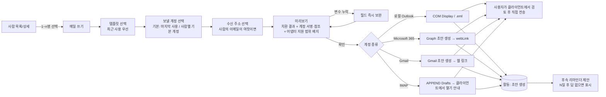
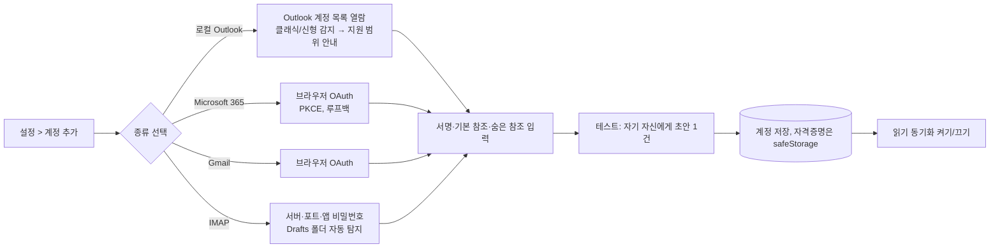
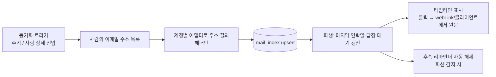
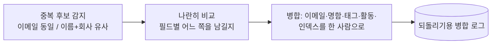
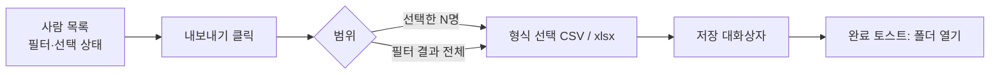
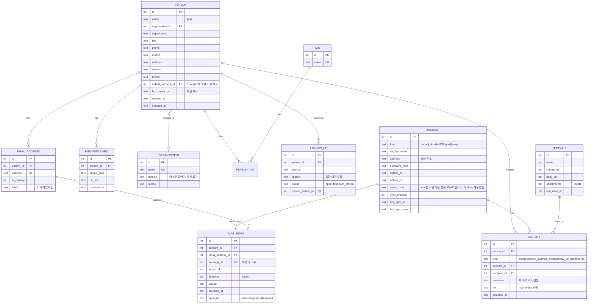
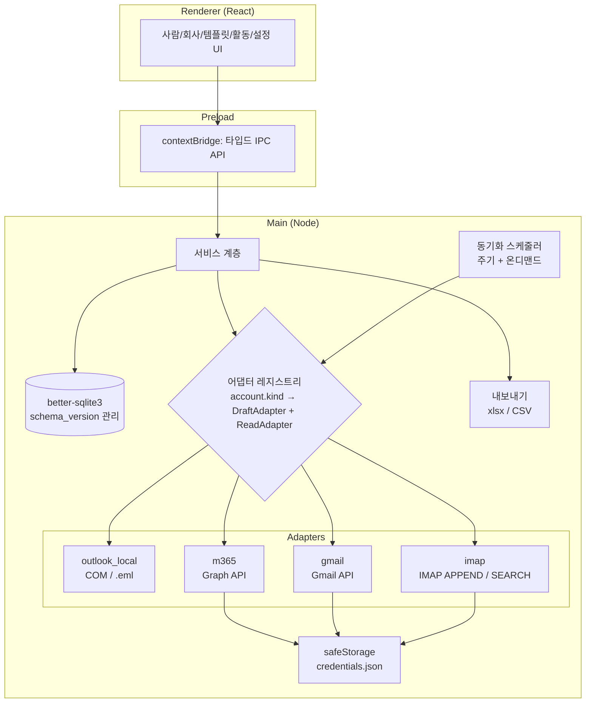

# whenmail — 사람 관계 레이어(개인 CRM) + 명함 기반 이메일 초안 데스크톱 앱 설계

- 버전: v2.0 (2026-09-16)
- 상태: draft
- 작성 근거: v1.x 구현 완료(M1~M3) 후 방향 전환 논의(2026-09-16 사용자 결정 4건) + Graph API·Gmail API 초안 생성 문서 확인

> v1.x는 "명함 → 템플릿 → Outlook 초안" 단일 루프였다. v2는 그 루프를 유지한 채, 앱의 정체를 **여러 메일 계정 위에 얹히는 사람 관계 레이어**로 바꾼다. 메일을 읽고 쓰는 일은 기존 클라이언트에 맡기고, whenmail은 "이 사람과 무슨 일이 있었고 다음에 뭘 해야 하나"에 답한다.

---

## 1. 배경 · 목적

### v1 배경(유지)
명함으로 받은 연락처에 인사·제안 메일을 보낼 때마다 ① 명함에서 정보를 옮겨 적고 ② 과거에 쓴 메일을 찾아 복사하고 ③ 이름/회사만 바꿔 보내는 반복 작업이 발생한다. 이 과정에서 **이름·회사를 잘못 바꿔 보내는 사고**가 가장 큰 리스크다.

### v2 배경(추가)
- 메일 계정이 하나가 아니다. 회사 Microsoft 365, 개인 Gmail, 그 외 IMAP 계정이 섞여 있고, 상대에 따라 어느 계정으로 보내야 하는지가 다르다.
- 한 사람이 이메일을 여럿 갖는다(회사·개인, 이직 후 새 주소). 지금 모델(명함 1장 = 연락처 1건, 이메일 1개)로는 같은 사람이 여러 건으로 쪼개진다.
- "이 사람과 마지막으로 언제 연락했나", "내가 보내고 답 없는 사람이 누구인가"를 메일 클라이언트에서 계정별로 뒤져야 한다.
- 축적한 명함 데이터를 다른 도구(엑셀, 메일 클라이언트 주소록)로 가져갈 방법이 백업 zip밖에 없다.

**목적(우선순위순)**
1. 명함 정보 → 템플릿 치환 → 초안까지를 클릭 몇 번으로 단축 (v1 유지)
2. 치환 결과를 보내기 전에 눈으로 확인 — 자동 전송이 아닌 **초안 만들기** (v1 유지)
3. **사람 단위로** 명함·이메일 주소·회사·주고받은 메일·후속 할 일을 한곳에 모아 본다 (v2 신규)
4. 등록한 계정 종류에 따라 초안 생성·메일 읽기 경로가 자동으로 정해진다 — 사용자는 어댑터를 몰라도 된다 (v2 신규)
5. 명함 데이터는 언제든 표 형식으로 꺼낼 수 있다 (v2 신규)

## 2. 페르소나 → 요구 환원

| 페르소나 특성 | 도출되는 요구 |
|---|---|
| 영업/대외 업무로 명함을 자주 받는 직장인 1인 | 로컬 저장, 서버 불필요, 설치 즉시 사용. **팀 공유 없음**(v2에서 재확인) |
| 회사 메일은 Microsoft 365, 개인 메일은 Gmail 등 **계정이 여럿** | 계정을 등록하면 그 계정으로 초안을 만들 수 있어야 함. 계정마다 서명·기본 참조가 다름 |
| 상대가 고객이라 오발송에 민감 | 전송 전 초안 확인이 기본 동선. "즉시 전송" 없음. **어느 계정으로 보내는지도 미리보기에 표시** |
| 같은 사람을 여러 경로(명함·메일·이직)로 다시 만남 | 사람 1명 ↔ 이메일 N개, 명함 N장. 중복 병합 |
| "그 사람한테 답장 왔었나?"를 기억하지 못함 | 사람별 메일 왕래 타임라인, 답 없는 사람 목록, 후속 알림 |
| 메일 본문이 로컬 DB에 쌓이는 건 부담 | **헤더 메타데이터만** 인덱싱. 본문은 클라이언트에서 열기 |
| 명함이 종이로 쌓여 있음 | OCR 등록(v1.5 완료), CSV 일괄 등록(완료) |
| 명함 데이터를 엑셀·주소록으로 옮기고 싶음 | 목록 내보내기(CSV/xlsx), 가져오기와 컬럼 왕복 호환 |

## 3. 스코프

**v2 포함**
- **사람 모델 전환**: 사람 / 이메일 주소(1:N) / 회사 엔티티 / 명함(사람에 붙는 출처 문서) / 중복 병합
- **계정 등록**: 계정 종류(로컬 Outlook · Microsoft 365 · Gmail · IMAP)를 골라 등록. 계정 = 발신 프로필(발신 주소·서명·기본 참조·숨은 참조)
- **계정 종류 → 어댑터 자동 결정**: 초안 생성 경로와 읽기 경로가 계정 종류에서 도출됨. 사용자는 초안 시 "어느 계정으로"만 고른다
- **읽기 통합(헤더 메타데이터만)**: 등록 계정에서 사람의 이메일 주소와 오간 메일의 제목·날짜·방향·메시지 ID만 인덱싱. 본문·첨부는 저장하지 않음
- **활동 타임라인**: 명함 등록 · 초안 생성 · 메일 송수신(인덱스) · 메모 · 후속 할 일을 사람 단위로 한 줄기에
- **후속 리마인더**: "N일 안에 답 없으면 표시". 읽기 인덱스로 회신 감지 시 자동 해제
- **명함 목록 내보내기**: 현재 필터·선택을 반영해 CSV/xlsx로. 가져오기 컬럼과 동일 구조
- v1 기능 전부 유지(템플릿·치환·미리보기·OCR·가져오기·백업·커맨드 팔레트)

**v2 제외 (근거)**
- **팀 공유/동기화** — 사용자 결정(2026-09-16). 서버 계층이 생기면 다른 프로젝트가 됨
- **자동 전송/예약 전송** — v1 결정 유지. Graph·Gmail 어댑터도 "초안 생성"까지만 호출
- **메일 본문 저장·검색** — 프라이버시·용량·백업 부담. 헤더만 저장하고 본문은 링크로 클라이언트에서 열기
- **통합 받은편지함 UI** — 메일 클라이언트를 재발명하지 않는다. 사람 화면 안의 타임라인으로만 노출
- **수신 확인(오픈 트래킹)** — 초안 방식에서 불가

## 4. 벤치마크

| 제품/방식 | 장점 → 적용 | 단점 → 개선 |
|---|---|---|
| 리멤버 | 명함 필드 구조(회사/부서/직함 분리) → v1에서 채용, v2에서 회사를 엔티티로 승격 | 메일 발송 연동 없음, 클라우드 강제 → 로컬 + 다중 계정 초안 루프가 차별점 |
| Word 편지 병합 + Outlook | 대량 치환 | 개별 확인 불가, 단일 계정 → 건별 초안 + 계정 선택 |
| Outlook 빠른 문서 요소/서명 | 반복 문구 재사용, 계정별 서명 → 계정 = 발신 프로필 개념으로 흡수 | 수신자 치환 없음 → 변수 치환 유지 |
| 개인 CRM류(Clay, Dex 등) *(추정, 2026-09 시점 미검증)* | 사람 단위 타임라인·"마지막 연락일"·후속 알림이 핵심 화면 → v2 IA의 사람 상세·활동 뷰에 채용 | 메일 본문까지 클라우드 동기화, 구독형 → 헤더만·로컬 저장으로 차별화 |
| 메일 클라이언트의 연락처 사이드바(Outlook People, Gmail 연락처 카드) | 메일 옆에서 사람 정보 확인 | 계정별로 분리되어 통합 시야 없음, 명함·템플릿 없음 → 계정을 가로지르는 사람 뷰 |

## 5. 핵심 기술 결정 (근거 + 폐기안)

### D-1. 전송 방식: 초안 만들기까지만 ✅ (v1 결정 유지, v2 재확인)
- Graph `POST /me/messages`, Gmail `drafts.create`, IMAP `APPEND` to Drafts 모두 "초안 폴더에 넣기"다. `sendMail`·`drafts.send`·SMTP는 호출하지 않는다.
- 폐기: 자동 전송·예약 전송(오발송 리스크, 목적 2와 상충)

### D-2. 초안 열기 구현: 어댑터 계층 ✅ (v1 결정 유지) → **D-5로 확장**

### D-3. 스택: Electron + React ✅ (유지)

### D-4. 저장: 로컬 SQLite 단일 파일 ✅ (유지)
- `%APPDATA%/whenmail/whenmail.db`. v0.5.0에서 `whenimail` 폴더·파일명 자동 이전(`src/main/migrate.ts`)
- v2부터 **스키마 버전 테이블**(`schema_version`)로 마이그레이션을 순번 관리한다. 지금처럼 `IF NOT EXISTS`·컬럼 존재 검사 나열은 사람 모델 전환(데이터 이동 포함)에 부적합

### D-5. 계정 종류가 어댑터를 결정한다 ✅ (2026-09-16 사용자 결정)
"어댑터를 고르는" 설정을 없애고 **계정을 등록**한다. 계정 종류가 초안 생성 경로와 읽기 경로를 결정하고, 사용자는 초안 시 "어느 계정으로 보낼지"만 고른다.

| 계정 종류 | 초안 어댑터 | 초안 열기 방식 | HTML | 첨부 | 발신 계정 지정 | 읽기 어댑터(헤더) |
|---|---|---|---|---|---|---|
| **로컬 Outlook(클래식)** | COM `MailItem.Display()` | 즉시 새 창 | ✅ | ✅ | ✅ `SendUsingAccount` | v2 후순위(오픈이슈 #10) |
| **로컬 Outlook(신형)** | `.eml` + `X-Unsent` | 불안정(오픈이슈 #1) | ⚠️ | ⚠️ | ❌ | ❌ → Microsoft 365 계정으로 등록 권장 |
| **Microsoft 365** | Graph `POST /me/messages` (`Mail.ReadWrite`) | Drafts 폴더 생성 → `webLink`로 웹 열기. 데스크톱 신형 Outlook은 초안 폴더 동기화로 노출 *(추정, 실기기 검증)* | ✅ | ✅ (attachments 추가 호출) | 계정 자체 | Graph `Mail.Read` + `$select` 헤더만 |
| **Gmail** | Gmail API `drafts.create` (`gmail.compose`) | Drafts 생성 → 웹 링크 | ✅ (MIME base64url) | ✅ | 계정 자체 | `gmail.metadata`(헤더만) *(제한 스코프 — 오픈이슈 #6)* |
| **IMAP(범용)** | IMAP `APPEND` → Drafts | 사용자의 클라이언트가 초안 폴더에서 열기 | ✅ | ✅ | 계정 자체 | IMAP `SEARCH FROM/TO` + `FETCH` 헤더 |
| (폴백) | `mailto:` | 기본 클라이언트 | ❌ | ❌ | ❌ | ❌ |

- **로컬 Outlook 계정은 "이 PC의 Outlook"이라는 뜻**이고, 실제 발신 주소는 Outlook에 설정된 계정 중에서 고른다(COM으로 계정 목록 열람). 같은 M365 주소를 로컬 Outlook과 Microsoft 365 두 종류로 각각 등록할 수 있다 — 경로가 다르므로 별개 계정으로 취급
- 어댑터별 지원 범위(위 표)를 **계정 설정 화면과 미리보기에 그대로 표시**한다. 미리보기가 실제 결과와 다를 수 있는 항목(신형 Outlook .eml)은 경고 배지
- 폐기: 전역 "연동 방식" 설정(v1) — 계정이 여럿이면 의미가 없음. 기존 설정값은 첫 실행 시 "로컬 Outlook" 계정 1건으로 자동 변환
- 근거 문서: Graph 초안 생성은 `POST /me/messages`에 `body.contentType: HTML`로 가능, `isDraft`로 구분, `webLink`로 웹에서 열기(learn.microsoft.com). Gmail은 MIME을 base64url로 `raw`에 넣어 `drafts.create`(developers.google.com)

### D-6. 읽기 통합은 헤더 메타데이터만 ✅ (2026-09-16 사용자 결정)
- 저장 항목: 메시지 ID, 스레드/대화 ID, 방향(보냄/받음), 상대 주소, 제목, 일시, 계정 ID, 원문 열기용 링크(`webLink` / Gmail 메시지 ID / IMAP UID)
- 저장하지 않음: 본문, 첨부, 참조·숨은 참조 전체 목록(상대 주소 매칭에 쓴 뒤 버림)
- 대상 범위: **등록된 사람의 이메일 주소와 오간 메일만**. 전체 메일함 인덱싱 아님. 주소별 질의(Graph `$filter`, Gmail `q=from:/to:`, IMAP `SEARCH`)로 가져온다
- 동기화: 앱 실행 중 주기 + 사람 상세 진입 시 해당 사람만 즉시. 백그라운드 상주는 오픈이슈 #8
- 이 인덱스에서 파생: 마지막 연락일, 답장 대기(내가 마지막으로 보낸 뒤 N일 경과), 연락 빈도
- 폐기: 본문 저장(프라이버시·용량·백업 위험), 통합 받은편지함 UI(클라이언트 재발명)

### D-7. 자격증명 저장 ✅
- OAuth 리프레시 토큰·IMAP 앱 비밀번호는 Electron `safeStorage`로 암호화해 DB 밖(`credentials.json` 등)에 둔다
- **백업 zip에서 제외**한다. 복원 후에는 계정 재인증 안내
- OAuth는 PKCE + 루프백 리디렉션(데스크톱 앱 공개 클라이언트). 클라이언트 시크릿을 앱에 넣지 않는다

### D-8. 팀 공유 제외 ✅ (2026-09-16 사용자 결정)
- 개인용 확정. 서버·계정·권한 계층 전부 없음. 다른 도구로 가져가는 요구는 D-9 내보내기로 충족

### D-10. 상주하지 않고 알림함에 쌓는다 ✅ (2026-09-16 사용자 결정)
- 트레이 상주·시작 프로그램 등록을 하지 않는다. 앱은 필요할 때 켜서 쓰는 도구로 둔다
- 대신 **알림함**을 둔다. 동기화 결과로 생긴 일(회신 대기, 회신 도착, 동기화 실패)을 `notification` 테이블에 쌓고, 레일의 종 아이콘에 안 읽은 수를 표시한다
- 알림은 `dedupe_key`로 같은 사건이 두 번 쌓이지 않게 막는다(예: `awaiting:{사람}:{마지막 발신 시각}`)
- 회신이 도착하면 그 사람의 열린 대기 알림을 자동으로 닫고 "회신 도착" 알림을 만든다
- 동기화 시점: ① 앱 시작 후 3초(설정으로 끌 수 있음) ② 알림함·설정의 "지금 확인" ③ 사람 상세의 "메일 확인"(그 사람 주소만)
- 폐기: OS 알림(상주 필요), 백그라운드 주기 동기화(상주 필요)

### D-11. 읽기 스코프 ✅
- Microsoft 365: 초안용 `Mail.ReadWrite`에 읽기가 포함되어 추가 동의가 필요 없다
- Gmail: 목록 검색(`q`)이 `gmail.metadata`에서 막혀 있어 읽기에는 `gmail.readonly`가 필요하다. 조회는 항상 `format=metadata`로만 해서 본문을 받아오지 않지만, 권한 자체는 넓어진다. 계정 편집에서 읽기를 켤 때 "읽기 권한으로 다시 연결"을 요구한다
- IMAP: 추가 권한 없이 `SEARCH`/`FETCH ENVELOPE`
- 로컬 Outlook: 읽기 미지원. 같은 주소를 Microsoft 365 계정으로도 등록하면 된다

### D-9. 명함 목록 내보내기 ✅ (2026-09-16 사용자 결정)
- 형식: **CSV(UTF-8 BOM, 엑셀 바로 열림)** + **xlsx**. 가져오기에서 쓰는 `xlsx` 라이브러리 재사용
- 범위: 현재 목록의 필터(검색·태그)와 선택 상태를 그대로 반영. "선택한 N명" 또는 "필터 결과 전체"
- 컬럼: 가져오기 매핑 컬럼과 동일(이름·회사·부서·직함·이메일·전화·휴대폰·주소·웹사이트·메모·태그). 태그는 `;` 구분. 이메일이 여럿이면 `이메일`(대표) + `추가 이메일`(`;` 구분) — **내보낸 파일을 다시 가져오면 동일 데이터가 복원**되는 왕복 호환이 요건
- 명함 이미지·메일 인덱스는 내보내기 대상 아님(백업 zip이 담당). vCard는 오픈이슈 #7

## 6. 정보구조 (IA)

단일 축(작업 대상) 분류, 최대 2뎁스. v1의 "명함"은 "사람"으로, "이력"은 "활동"으로 승격·흡수된다.

```
whenmail
├─ 사람        ── 목록(검색·태그·회사·답장 대기 필터, 내보내기) / 상세(연락 수단·명함·타임라인·후속) / 가져오기 / 병합
├─ 회사        ── 목록 / 상세(소속 사람·메모·파일)
├─ 템플릿      ── 목록 / 편집기(변수 삽입·미리보기·첨부)
├─ 활동        ── 전체 타임라인(초안·송수신·메모) / 후속 할 일(답장 대기·리마인더)
└─ 설정        ── 계정(등록·종류·서명·참조·동기화 상태) / 데이터 폴더 / 백업
```

- "메일 쓰기"는 v1과 같이 **사람 목록·상세에서 시작하는 액션**. 계정 선택은 그 액션의 한 단계
- "명함"은 메뉴가 아니라 사람 상세의 한 섹션(명함 N장). 명함 사진 OCR 등록은 "사람 > 가져오기"의 한 경로
- 커맨드 팔레트(Ctrl+K)는 새 축을 모두 관통: `홍길동 후속`, `ACME 사람`, `답 없는 사람`, `Gmail로 쓰기`

## 7. UX 플로우

### 핵심 루프: 사람 → 계정 선택 → 초안 (v1 루프에 계정 단계 추가)


### 계정 등록


### 읽기 동기화 → 타임라인


### 사람 병합


### 명함 목록 내보내기


### 예외 처리
- 이메일 없는 사람 선택 → v1과 동일(배지 + 제외 경고)
- 선택한 계정이 인증 만료 → 미리보기 단계에서 재인증 버튼. 다른 계정으로 전환 제안
- Graph/Gmail 호출 실패(네트워크·권한) → 같은 주소의 로컬 Outlook 계정이 있으면 그쪽으로 폴백 제안, 없으면 본문 클립보드 복사
- IMAP APPEND 성공했지만 사용자가 어디서 열지 모름 → "OO 클라이언트의 초안 폴더를 확인하세요" 안내 + Drafts 폴더 이름 표시
- 읽기 동기화 중 오류 → 사람 상세에 "마지막 동기화 실패(계정명)" 표시, 앱 흐름은 막지 않음
- 내보내기 대상 0명 → 버튼 비활성

## 8. 데이터 모델 (v2)



**v1 → v2 데이터 이전(스키마 버전 6→7, 앱 시작 시 1회, 실패 시 롤백)**
- `contact` → `person` (1:1). `contact.email`이 비어 있지 않으면 `email_address`(is_primary=1) 1건 생성
- `contact.company` 문자열이 같은 건 → `organization` 1건으로 묶어 `person.organization_id`에 연결. 도메인은 대표 이메일에서 추출해 채움(비어 있으면 null)
- `contact.card_image_path` → `business_card` 1건
- `contact_tag` → `person_tag`
- `draft_log` → `activity(kind=draft)`. 계정은 첫 실행 시 자동 생성되는 "로컬 Outlook" 계정으로 연결
- `setting`의 연동 방식·서명·참조 → 그 "로컬 Outlook" 계정의 필드로 이동
- 중복 판정: `email_address.address` 동일 → 같은 사람. 이름+회사 동일은 **후보만 제시**하고 자동 병합하지 않음
- 삭제: 사람 실삭제 시 활동은 남기고 `person_id`를 null로(스냅샷 `summary` 유지). 계정 삭제 시 그 계정의 `mail_index` 삭제, 활동은 유지

## 9. 템플릿 치환 스펙

- 문법·엔진: v1 유지. `{{필드}}`, `{{필드|기본값}}`, 알 수 없는 변수는 경고
- 지원 변수: 이름, 회사, 부서, 직함, 이메일(선택한 수신 주소), 전화, 휴대폰, 주소, 웹사이트, 메모, 보내는날짜 + **v2 추가: 보내는사람(계정 display_name), 보내는주소(계정 address), 마지막연락일**
- 서명·기본 참조는 템플릿이 아니라 **계정**에 속한다. 미리보기는 "템플릿 본문 + 선택 계정의 서명"으로 합성

## 10. 시스템 아키텍처 (v2)



- 어댑터 인터페이스 두 개로 분리: `DraftAdapter.createDraft(account, message) → { openRef }`, `ReadAdapter.searchHeaders(account, addresses, since) → MailHeader[]`. 로컬 Outlook은 Draft만 구현(Read는 오픈이슈 #10)
- OAuth 콜백은 main에서 루프백 HTTP 서버로 받는다. 렌더러는 토큰을 절대 보지 않는다
- 동기화는 main의 단일 큐. 같은 계정에 대한 동시 호출 금지, 429/쓰로틀은 지수 백오프
- v1 원칙 유지: 렌더러에서 Node 직접 접근 금지, 파일/DB/네트워크는 모두 main

## 11. 마일스톤 — 단계별 주 액션 교체

M1~M3(v1)은 완료. v2는 M4부터.

| 단계 | 사용자가 완수하는 액션 | 포함 | 외부 의존 |
|---|---|---|---|
| **M4 사람 모델 + 내보내기** | "같은 사람의 명함 2장을 한 사람으로 합치고, 고객 태그 목록을 엑셀로 뽑는다" | 스키마 버전 관리 도입, contact→person 이전, 이메일 1:N, 회사 엔티티, 병합 UI, 사람 상세 타임라인(기존 초안 이력 흡수), CSV/xlsx 내보내기 | 없음 |
| **M5 계정 등록 + 어댑터** ✅ *(v0.6.0)* | "회사 M365와 개인 Gmail을 등록하고, 같은 템플릿을 사람에 따라 다른 계정으로 초안 만든다" | 계정 CRUD·safeStorage, 로컬 Outlook 계정 자동 변환, Graph 초안 어댑터(오픈이슈 #1 해소 경로), Gmail 초안 어댑터, IMAP APPEND 어댑터, 계정 선택 단계, 어댑터 지원 범위 배지 | Azure 앱 등록(#5), Google OAuth 클라이언트(#6) — **앱에서 클라이언트 ID를 입력받는 방식으로 해소** |
| **M6 읽기 통합 + 알림함** ✅ *(v0.7.0)* | "사람 상세를 열면 그 사람과 오간 메일이 계정 구분 없이 시간순으로 보이고, 답 없는 사람이 알림함에 쌓인다" | ReadAdapter(Graph·Gmail·IMAP), mail_index, 온디맨드 동기화, 마지막 연락일·답장 대기 파생, 원문 열기 링크, **알림함** | 읽기 스코프(#5, #6) |
| **M7 후속·시퀀스** | "초안 만들면서 '2주 후 답 없으면 알려줘'를 걸고, 회신 오면 자동으로 사라진다" | 후속 리마인더, 회신 감지 자동 해제, 활동 뷰의 할 일 탭, 템플릿 시퀀스(순서만, 자동 전송 없음) | M6 |

각 단계는 이전 단계 없이도 배포 가능해야 한다. M4만 배포해도 v1보다 나쁜 점이 없어야 한다(모든 v1 기능 유지 + 내보내기).

## 12. KPI (개인 생산성 지표)

| 목표 | 지표 | 데이터원 |
|---|---|---|
| 작성 시간 절감 (유지) | 초안 1건 생성 소요(선택→초안) | 앱 내 타이머 로그 |
| 실제 사용 정착 (유지) | 주간 초안 생성 건수 | ACTIVITY(kind=draft) |
| 데이터 자산화 (유지) | 등록 사람 수 추이, 사람당 이메일 주소 수 | PERSON / EMAIL_ADDRESS |
| 다중 계정 활용 (신규) | 계정별 초안 비율, 계정 2개 이상 등록 여부 | ACTIVITY.account_id |
| 관계 시야 (신규) | 사람 상세에서 타임라인 조회 횟수, "답장 대기" 목록 진입 횟수 | UI 이벤트 로그(로컬) |
| 후속 이행 (신규) | 후속 리마인더 중 기한 내 처리(done+auto_closed) 비율 | FOLLOW_UP |
| 데이터 이동성 (신규) | 내보내기 실행 횟수 | UI 이벤트 로그(로컬) |

## 13. 오픈이슈

| # | 이슈 | 상태 |
|---|---|---|
| 1 | 신형 Outlook 단독 환경의 HTML 초안 품질(.eml 불안정) → **Microsoft 365(Graph) 계정 구현 완료(v0.6.0)**. 남은 것은 실기기 검증: Graph로 만든 초안이 신형 Outlook 데스크톱 초안 폴더에 바로 보이는지, `webLink`의 `ispopout=0`이 편집 화면을 여는지 | 실기기 검증 대기 |
| 2 | ~~OCR 엔진~~ → Tesseract 확정 (2026-09-01) | 해결 |
| 3 | 명함 앞/뒷면 2장 관리 → v2 `business_card` 1:N으로 자연 해소. 앞/뒷면 구분 필드 필요 여부만 남음 | M4 |
| 4 | ~~프로젝트/제품명 확정~~ → **whenimail**로 확정 (2026-09-01) → **whenmail**로 개명 (2026-09-16) | 해결 |
| 5 | ~~Azure 앱 등록 방식~~ → **앱에 클라이언트 ID를 입력받는 방식으로 확정** (2026-09-16). 앱은 시크릿 없이 PKCE로만 동작하고, 사용자가 본인 명의 앱을 등록해 ID를 넣는다. 테넌트 정책이 동의를 막는 경우가 남아 있으나 *(추정)* 실제 연결 시 오류 메시지로 드러난다. 현재 요청 스코프: `Mail.ReadWrite`, `User.Read`, `offline_access` | 해결 (연결 실검증 대기) |
| 6 | ~~Gmail OAuth 운영 방식~~ → **테스트 모드(테스트 사용자 등록)로 확정** (2026-09-16). 사용자가 Google Cloud에 본인 데스크톱 앱 클라이언트를 만들고 ID·시크릿을 앱에 넣는다(데스크톱 앱 유형은 시크릿을 함께 발급하므로 safeStorage에 저장). 스코프: 초안 `gmail.compose`, 읽기 `gmail.readonly`(D-11). **2026-09-17 실기기 검증 완료** — 브라우저 로그인·토큰 교환·갱신·읽기 권한 재연결·헤더 조회까지 동작. 함정: OAuth 클라이언트를 만들어도 **프로젝트에서 Gmail API를 따로 사용 설정해야** 한다. 켜지 않으면 초안·읽기 모두 `403 Gmail API has not been used in project …` | 해결 (실검증 완료) |
| 7 | 내보내기 vCard(.vcf) 지원 여부 — 메일 클라이언트 주소록 가져오기용. CSV/xlsx 먼저, 수요 확인 후 | M4 이후 |
| 8 | ~~읽기 동기화의 상주 여부~~ → **상주하지 않는다**로 확정 (2026-09-16 사용자 결정). 앱을 켤 때 1회 + 사용자가 누를 때만 동기화하고, 그 사이에 생긴 일은 **알림함**(D-10)에 쌓아 앱을 켰을 때 확인한다 | 해결 |
| 12 | OAuth 리디렉션을 루프백 `http://127.0.0.1:<임의 포트>/callback`으로 구현했다. **Google은 2026-09-17 실검증 통과**(임의 포트 허용). Azure 앱 등록의 "모바일 및 데스크톱" 플랫폼은 `http://localhost`를 허용하지만 임의 포트 허용 여부는 아직 미확인 *(추정)*. 막히면 고정 포트 등록으로 전환 | Microsoft만 실검증 대기 |
| 13 | Graph 첨부는 파일당 3MB 제한(초과 시 업로드 세션 필요). 지금은 3MB를 넘으면 오류 메시지로 막는다. 큰 첨부 수요가 생기면 `createUploadSession` 추가 | 수요 확인 후 |
| 14 | 설정 오류를 앱에서 바로 처리하지 못한다. 예: Gmail API 미사용 설정 시 403이 뜨지만 알림함에는 본문 텍스트로만 남아 콘솔 링크를 누를 수 없다. 오류 종류를 알아보고 해결 링크·버튼을 붙이는 개선 여지 | 개선 후보 |
| 9 | 이름·회사만 같은 동일인 병합 기준(이메일이 다를 때). 자동 병합은 하지 않고 후보 제시로 시작 | M4 |
| 10 | 로컬 Outlook(클래식) 계정의 읽기 어댑터: COM `Items.Restrict`로 주소별 검색 가능 *(추정, 대용량 메일함 속도 미확인)*. 같은 주소를 Microsoft 365 계정으로도 등록하면 불필요 | M6 후순위 |
| 11 | ~~복원 후 재인증 UX~~ → **구현 완료**. `credentials.json`은 백업 zip에서 빠지고, 토큰이 없는 계정은 목록·초안 화면에서 "재연결 필요" 배지로 표시되며 초안 생성이 막힌다 | 해결 |

## 개정 이력
- v1.0 (2026-09-01): 최초 작성. 전송 방식·입력 방식·저장 방식·스택 결정 반영
- v1.1 (2026-09-01): 제품명 whenimail 확정, GitHub 레포 생성(when630/whenimail)
- v1.2 (2026-09-01): M1~M3 구현 완료. 추가 구현: Ctrl+K 커맨드 팔레트(설계에 없던 핵심 동선, 2026 트렌드 조사 기반), 아이콘 레일 내비, 백업/복원. OCR 엔진 Tesseract 확정(이슈 #2 해결)
- v2.0 (2026-09-16): whenmail로 개명(레포·앱·데이터 폴더 자동 이전). 방향 전환 — 사람 관계 레이어(개인 CRM). 사용자 결정 4건 반영: ① 읽기 통합 포함, 헤더 메타데이터만(D-6) ② 계정 등록이 어댑터를 결정(D-5) ③ 팀 공유 제외(D-8) ④ 명함 목록 내보내기 추가(D-9). 데이터 모델 v2(사람/이메일 1:N/회사/계정/활동/메일 인덱스/후속), IA 개편(명함→사람, 이력→활동, 회사 추가), M4~M7 마일스톤, 오픈이슈 #5~#11 추가
- v2.1 (2026-09-16): **M4 구현 완료** — 스키마 버전 관리(schema_version, v1→v2 자동 이전 + 이전 전 .bak-v1 백업), 사람/이메일 1:N/회사/명함 1:N/활동 모델, 사람 상세 타임라인·메모, 중복 정리(병합), 회사 화면, CSV/xlsx 내보내기(가져오기와 왕복 호환), 초안 시 수신 주소 선택. v0.5.0 릴리즈
- v2.2 (2026-09-16): **M5 구현 완료** — 스키마 v3(account 테이블, 전역 Outlook 설정 → "이 PC의 Outlook" 계정 1건 자동 이전), 계정 종류 4종(로컬 Outlook·Microsoft 365·Gmail·IMAP)과 어댑터 레지스트리, OAuth 2.0 PKCE + 루프백 리디렉션, `safeStorage` 자격증명 저장(백업 제외), 계정별 서명·기본 참조, 초안 시 계정 선택과 지원 범위 배지, 계정 테스트 초안. 오픈이슈 #5·#6·#11 해결, #12·#13 추가. v0.6.0 릴리즈
- v2.3 (2026-09-16): **M6 구현 완료** — 스키마 v4(mail_index 헤더 인덱스, notification 알림함, person 연락 시각 캐시), 읽기 어댑터 3종(Graph `$search=participants`, Gmail `q` + `format=metadata`, IMAP `SEARCH`+`ENVELOPE`), 온디맨드 동기화(상주 없음), 답장 대기 판정과 목록 필터, 사람 타임라인에 메일 송수신 병합, 알림함(회신 대기·회신 도착·동기화 실패, 자동 종료·중복 방지). 결정 D-10·D-11 추가, 오픈이슈 #8 해결. v0.7.0 릴리즈
- 병합 버그 수정: `mail_index`·`notification`이 `person`을 `ON DELETE CASCADE`로 참조해, 사람 병합 시 원본을 먼저 지우면 메일·알림이 사라졌다. 옮긴 뒤 삭제하도록 순서를 바로잡음(통합 테스트로 발견)
- v2.4 (2026-09-17): **Gmail 계정 실기기 검증 완료** — OAuth(PKCE + 루프백 임의 포트), 읽기 권한 재연결, 헤더 조회까지 동작 확인. 오픈이슈 #6 실검증 완료로 갱신, #12는 Google 통과·Microsoft만 대기로 축소, #14(설정 오류 안내 개선) 추가. 남은 실기기 검증: Microsoft 365 연결(#1, #12), IMAP 초안 폴더 탐지, v0.4.1 → 최신 데이터 이전
